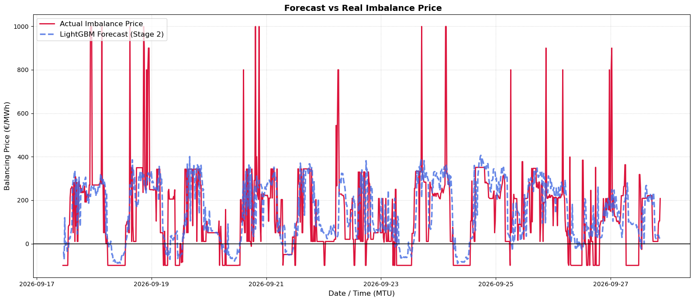

## Balancing Spread Direction Performance & Backtesting Analysis

The balancing direction model's robustness was evaluated using an out-of-sample backtest initiated on **01/07/2025** across **25,536 Market Time Units (MTUs)**. The objective is predicting the imbalance spread sign ($\text{Spread} = \text{OTA} - \text{OTS}$), identifying whether the system is short ($\text{OTA} > \text{OTS}$) or long ($\text{OTA} \le \text{OTS}$).

### Overall Out-of-Sample Metrics

| Metric | Out-of-Sample Value |
| :--- | :--- |
| **Total Test MTUs** | 25,536 |
| **Directional Accuracy (Hit Ratio)** | 74.58% |
| **Long Precision / Recall** | 0.772 / 0.736 |
| **Short Precision / Recall** | 0.719 / 0.757 |
| **Mean Absolute Spread on Error** | 74.63 €/MWh |
| **Max Spread Error Exposure** | 908.77 €/MWh |

### Confusion Matrix Breakdown

| Actual \ Predicted | Predicted Long (OTA ≤ OTS) | Predicted Short (OTA > OTS) | Total Support |
| :--- | :--- | :--- | :--- |
| **Actual Long** | 9,919 (38.8%) — *True Negatives* | 3,561 (13.9%) — *False Positives* | 13,480 |
| **Actual Short** | 2,931 (11.5%) — *False Negatives* | 9,125 (35.7%) — *True Positives* | 12,056 |

### Directional Accuracy by Spread Magnitude Bin

| Spread Bin (€/MWh) | Hit Rate (%) | Avg Actual Spread (€/MWh) | MTU Count |
| :--- | :--- | :--- | :--- |
| **(-inf, -100.0]** | 78.9% | -144.94 | 4565 |
| **(-100.0, -30.0]** | 74.7% | -61.24 | 7030 |
| **(-30.0, 0.0]** | 56.4% | -15.58 | 1885 |
| **(0.0, 30.0]** | 70.8% | 15.83 | 4455 |
| **(30.0, 100.0]** | 78.1% | 53.51 | 4823 |
| **(100.0, 500.0]** | 79.1% | 185.27 | 2416 |
| **(500.0, inf]** | 80.7% | 802.49 | 362 |

### Visualizing the Forecast (Balancing Spread Direction)

